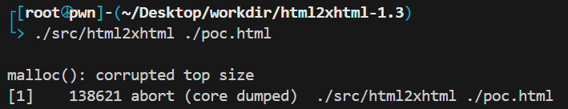
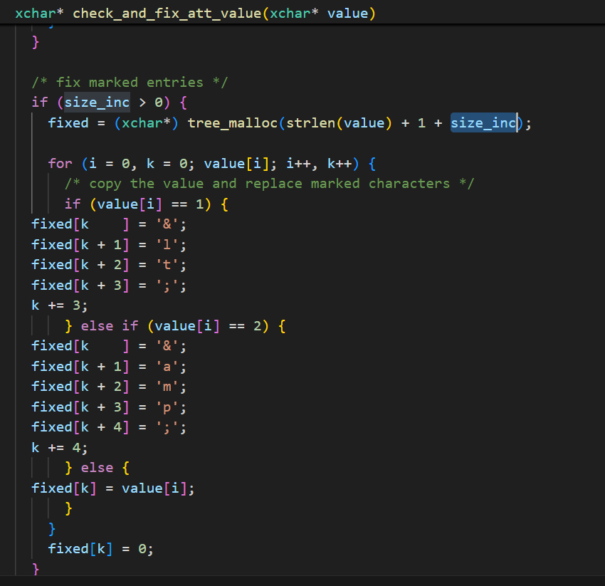

# Project address

https://github.com/jfisteus/html2xhtml

# Affected version

1.3

# Crash recurrence

```
git clone https://github.com/jfisteus/html2xhtml.git
./configure
make
./src/html2xhtml ./poc.html
```



Reproduces the crash file：

 [poc.zip](html2xhtml-1.3-check_and_fix_att_value-heap-buffer-overflow.assets/poc.zip) 


# root cause analysis

In html2xhtml-1.3, check_and_fix_att_value function has heap overflow vulnerability. fixed variable subscript can exceed the parameter size of tree_malloc function. When k=358, heap overflow will occur when fixed is assigned.



